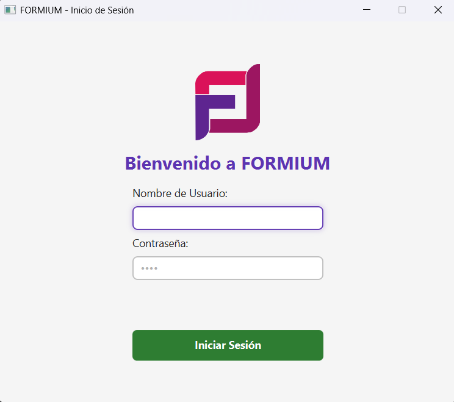
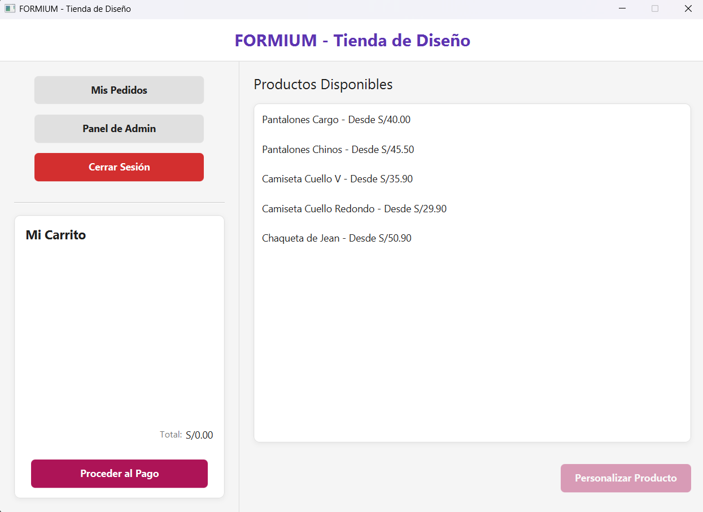
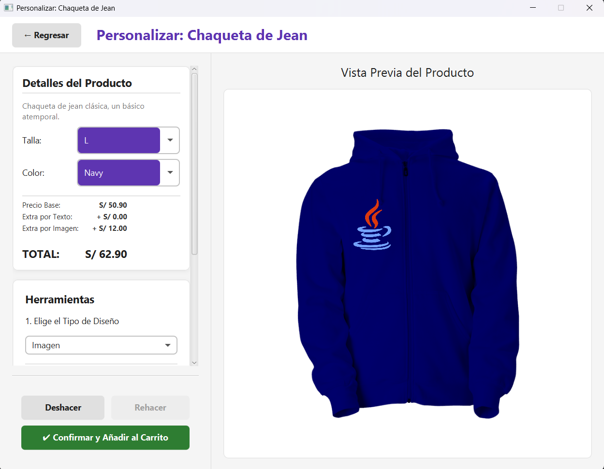
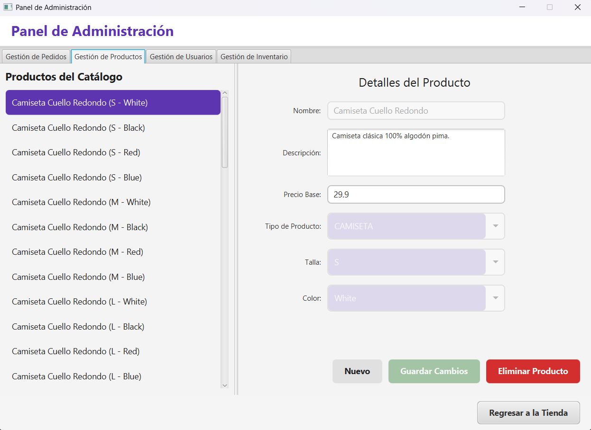

> [!TIP]
> # 📘 Caso de Estudio de Arquitectura (2025)
> 
> -success?style=flat-square) 
>
> **Este repositorio ha sido archivado tras su finalización en Julio de 2025.**
>
> Se mantiene público como un **recurso de referencia académica** sobre la implementación práctica de **Patrones de Diseño (GoF)** en aplicaciones empresariales Java.
>
> **Destacado:** Revisa la sección [Patrones de Diseño Aplicados](#-patrones-de-diseño-aplicados) para ver implementaciones reales de *Memento, Observer, Command y Abstract Factory*.

---

# FORMIUM - Sistema de Tienda de Ropa Personalizable

**Versión:** 1.0.0  
**Fecha:** Julio 2025

[](https://opensource.org/licenses/MIT)


> FORMIUM es una aplicación de escritorio que ofrece una solución completa para la gestión de una tienda de ropa personalizable, aplicando rigurosamente patrones de diseño de software para garantizar un sistema robusto, escalable y fácil de mantener.

## Tabla de Contenidos
1. [Características Principales](#-características-principales)
2. [Patrones de Diseño Aplicados](#-patrones-de-diseño-aplicados)
3. [Stack Tecnológico](#-stack-tecnológico)
4. [Instalación y Ejecución](#-instalación-y-ejecución)
5. [Capturas de Pantalla](#-capturas-de-pantalla)
6. [Agradecimientos](#-agradecimientos)
7. [Licencia](#-licencia)

---

## ✨ Características Principales

### Módulo de Cliente
* **Autenticación de Usuarios**: Sistema de login seguro para diferenciar entre clientes y administradores.
* **Catálogo de Productos**: Visualización de productos disponibles (camisetas, chaquetas, pantalones) con detalles como talla, color y material.
* **Personalización Avanzada de Productos**: Interfaz interactiva que permite a los usuarios añadir elementos de diseño (texto e imágenes) a las prendas.
* **Deshacer/Rehacer Cambios**: Funcionalidad para revertir y reaplicar cambios durante la personalización de un diseño.
* **Carrito de Compras**: Agrega productos personalizados al carrito, modifica cantidades y visualiza el total.
* **Proceso de Checkout y Pedidos**: Finaliza la compra y genera un pedido que el administrador puede gestionar. El cliente puede consultar su historial de pedidos.

### Módulo de Administración
* **Dashboard Centralizado**: Una vista de pestañas para una gestión eficiente.
* **Gestión de Usuarios**: Creación, visualización y modificación de los usuarios del sistema.
* **Gestión de Productos**: Permite al administrador añadir nuevos productos base al catálogo, especificando sus atributos.
* **Gestión de Inventario**: Control del stock disponible para cada variante de producto (talla, color).
* **Gestión de Pedidos**: Visualización de todos los pedidos realizados, con la capacidad de actualizar su estado (p. ej., de 'Pendiente' a 'Procesando', 'Enviado', etc.).

---

## 📐 Patrones de Diseño Aplicados

Este proyecto sirve como un caso de estudio práctico sobre la implementación de patrones de diseño GoF (Gang of Four).

### Patrones Creacionales
* **Factory Method**: Utilizado en `FactoriaProducto` para crear instancias de `Producto` (`ProductoCamiseta`, `ProductoChaqueta`, etc.) sin exponer la lógica de creación al cliente. El administrador selecciona el tipo de producto a crear y la factoría se encarga de instanciar el objeto correcto.
* **Abstract Factory**: Implementado a través de `FactoriaAbstractaPersonalizacion` para crear familias de elementos de diseño. Esto permite, por ejemplo, tener diferentes sets de personalización (básica, premium) en el futuro.
* **Builder**: Usado en la clase `Pedido` con su `ConstructorPedido` anidado. Facilita la creación de objetos `Pedido` complejos, permitiendo construir el objeto paso a paso y asegurando su consistencia antes de la creación final.
* **Singleton**: Aplicado en clases como `GestorDeEstado` y `CarritoCompras` para garantizar que exista una única instancia global de estos objetos, proporcionando un punto de acceso único y controlado al estado de la sesión del usuario y al carrito.

### Patrones Estructurales
* **Composite**: Implementado en el sistema de personalización con `ElementoDiseno` (componente), `ElementoTexto` / `ElementoImagen` (hojas) y `GrupoElementosDiseno` (compuesto). Permite tratar tanto a los elementos individuales como a los grupos de elementos de diseño de manera uniforme, facilitando la creación de diseños complejos y anidados.
* **Facade**: La capa de servicios (`ServicioUsuario`, `ServicioPedido`, `ServicioInventario`) actúa como una fachada que simplifica la interacción con el subsistema de persistencia (JPA/Hibernate) y la lógica de negocio. Los controladores de la UI interactúan con esta fachada en lugar de hacerlo directamente con la base de datos.

### Patrones de Comportamiento
* **Observer**: Utilizado para notificar cambios en el inventario. `GestorInventario` actúa como el *sujeto* y `ObservadorGerente` y `ObservadorLogistico` como *observadores*. Cuando se cancela un pedido y se repone el stock, los observadores son notificados automáticamente para tomar acciones (p. ej., generar informes o alertas de bajo stock).
* **State**: Gestiona el ciclo de vida de un `Pedido` a través de la interfaz `EstadoPedido` y sus implementaciones (`EstadoPendiente`, `EstadoProcesando`, `EstadoEnviado`, etc.). El objeto `Pedido` (contexto) cambia su comportamiento dinámicamente según su estado actual, lo que simplifica la lógica de transiciones.
* **Command**: Encapsula las acciones de gestión de pedidos del administrador (`Procesar`, `Enviar`, `Cancelar`) como objetos. El `AdminPedidosControlador` crea comandos (`ComandoProcesarPedido`, etc.) y un `InvocadorComando` los ejecuta. Esto desacopla al emisor de la acción del receptor.
* **Memento**: Implementado para la funcionalidad de "deshacer" y "rehacer" en la pantalla de personalización. `DisenoOriginador` crea un `RecuerdoDiseno` (memento) que guarda el estado de los elementos de diseño. El `HistorialDiseno` (caretaker) gestiona la pila de mementos para restaurar estados previos.

---

## 🛠️ Stack Tecnológico

* **Lenguaje**: Java 17
* **Framework UI**: JavaFX 17
* **Gestor de Dependencias y Build**: Apache Maven
* **Persistencia**: Jakarta Persistence API (JPA) con implementación de Hibernate.
* **Base de Datos**: H2 Database (embebida, modo fichero).
* **Serialización JSON**: Google Gson

---

## 🚀 Instalación y Ejecución

### Prerrequisitos
* JDK 17 o superior.
* Apache Maven 3.8.x o superior.
* Git.

### Pasos para la Ejecución

1.  **Clonar el repositorio:**
    ```
    git clone https://github.com/Ferinjoque/formium.git
    cd formium
    ```

2.  **Compilar y ejecutar con Maven:**
    El proyecto está configurado con el plugin de JavaFX para Maven, lo que facilita su ejecución.
    ```
    mvn clean javafx:run
    ```
    Este comando compilará el proyecto y lanzará la aplicación.

3.  **Base de Datos y Datos Iniciales:**
    * El sistema utiliza una base de datos H2 embebida que se crea automáticamente en el directorio raíz del proyecto (`tienda_db.mv.db`).
    * En la primera ejecución, la base de datos es poblada con datos de prueba (usuarios, productos y stock inicial) gracias a la clase `InicializadorBD`.

4.  **Credenciales de Acceso:**
    Se ha creado un usuario de prueba para facilitar la evaluación:
    * **Administrador**:
        * **Usuario**: `sa`
        * **Contraseña**: `1234`

---

## 📸 Capturas de Pantalla

| Vista de Login | Vista Principal (Catálogo) |
| :---: | :---: |
|  |  |

| Vista de Personalización | Panel de Administración |
| :---: | :---: |
|  |  |

---

## 🙏 Agradecimientos

* **Equipo de desarrollo**:
    * Marjoret Lopez
    * Esthepfany Macollunco

---

## 📄 Licencia

Este proyecto está bajo la Licencia MIT. Consulta el archivo `LICENSE` para más detalles.
